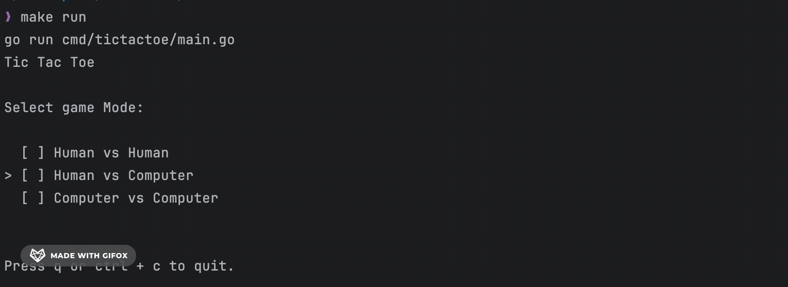

# Tic Tac Toe

## Examples


### Human vs Human


### Human vs Computer



### Computer vs Computer


### Design
Logic is implemented in domain directory. It is divided into 4 packages:
- game: contains the game logic. Game is responsible for managing the game state and the matching between players and board's cell values.
- player: contains the human player logic
- board: contains the board logic. Board is responsible for managing the board state and calculating the winner: X or 0 or the end of the game.
- computer: contains the computer turn playing logic, choosing the best move.

Interface is implemented in cmd directory. It is divided into 4 packages:
- game: contains the base game model and is used in a case of human vs human game mode also it is used by human vs computer game model
- humanvscomputer: contains the human vs computer game model, it uses game model
- computervscomputer: contains the computer vs computer game model
- pkg: contains the tools helping to run the game: choosing from options model, choosing game mode, choosing computer strategy, etc.

### Launching the game

```bash
make run
```